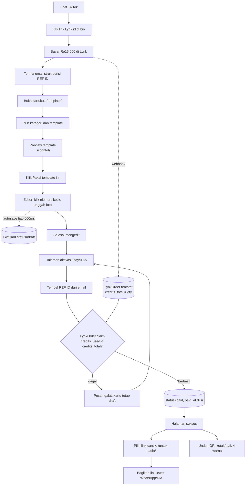
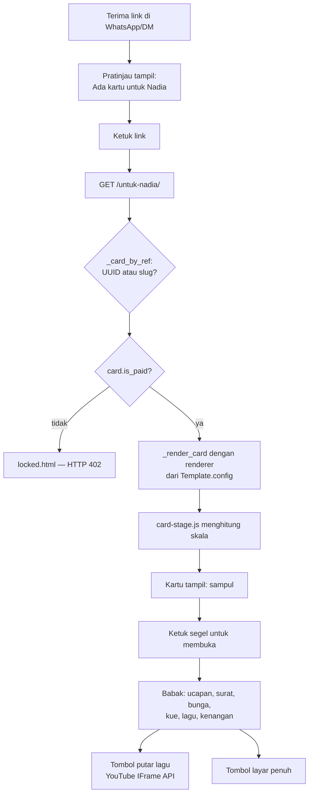
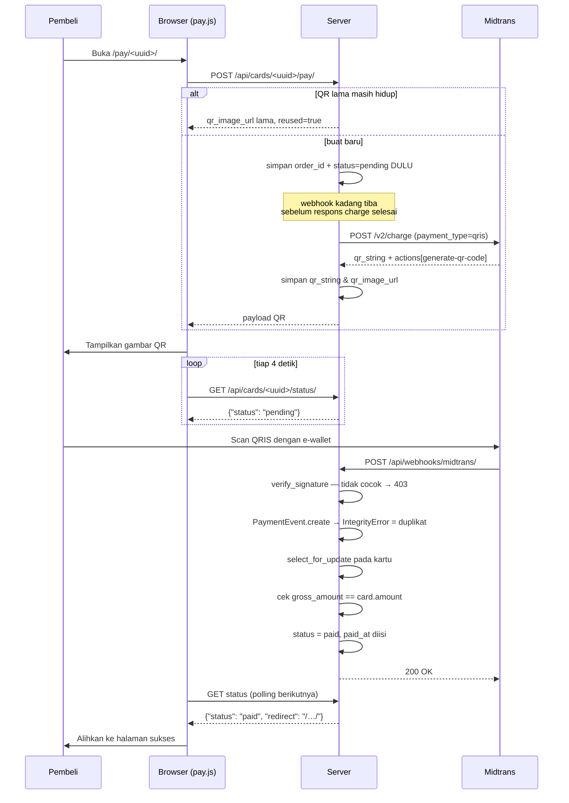

# Project Bible — Kartuku (Kartu Ucapan Digital)

> Dokumen induk proyek `~/giftcard`. Seluruh isinya diverifikasi dari pembacaan
> kode pada **6 Agustus 2026** (commit `4556f6c`), bukan dari rencana atau asumsi.
> Untuk detail teknis developer, lihat [`02-TECHNICAL-DOCUMENTATION.md`](02-TECHNICAL-DOCUMENTATION.md).

## Hubungan dengan dokumen lama di root

Proyek ini punya tiga dokumen yang lahir lebih dulu. Semuanya **tetap ada dan tidak diubah**:

| Berkas | Isi | Keakuratan per 6 Agustus 2026 |
|---|---|---|
| `CLAUDE.md` | Blueprint arsitektur + keputusan yang dikunci + catatan status | **Sebagian usang.** §5 (Data Model) dan §10 (API Endpoints) tertinggal jauh dari kode. Bagian §2, §6.2, §7, §12, §13 masih relevan dan berharga. |
| `README.md` | Cara menjalankan + resep menambah template | Akurat. |
| `DEPLOY.md` | Deploy PythonAnywhere + sambungan webhook Lynk.id | Akurat. |

Di mana dokumen ini berbeda dari `CLAUDE.md`, perbedaannya ditandai eksplisit
dengan kotak **Divergensi**. Yang benar adalah kode.

---

## 1. Ringkasan & Tujuan Aplikasi

### Masalah yang diselesaikan

Orang ingin memberi ucapan yang terasa personal untuk momen besar (ulang tahun,
anniversary, lamaran), tapi pilihannya cuma dua dan dua-duanya buruk:

- **Kartu fisik** — mahal, butuh waktu kirim, dan tidak bisa memuat foto, lagu, atau video.
- **Chat biasa** — gratis dan instan, tapi tenggelam di antara ratusan pesan lain
  dan tidak terasa seperti hadiah.

Kartuku mengisi celah itu: kartu digital yang dibuat sendiri dalam beberapa menit,
berisi foto, pesan panjang, dan lagu YouTube yang otomatis berputar sebagai musik
latar — lalu dibagikan sebagai **satu link permanen**.

### Target pengguna

Dua pihak, dengan kebutuhan yang berbeda:

- **Pembeli** — mayoritas datang dari TikTok, membeli untuk pasangan/teman/keluarga.
  Membayar Rp15.000 sekali. Sebagian besar membuka situs dari HP.
- **Penerima** — tidak pernah menyentuh situs kecuali lewat link yang dikirimkan
  pembeli, biasanya lewat WhatsApp/DM. Tidak perlu akun, tidak perlu install apa pun.

Situs ini **tidak punya sistem login untuk pembeli sama sekali**. Kepemilikan
kartu dilacak lewat session cookie; pemilik situs login lewat Django admin.

### Value proposition

| Janji | Bagaimana ditepati di kode |
|---|---|
| Sekali bayar, tanpa langganan | `CARD_PRICE = 15_000` di `config/settings.py`; tidak ada tier harga di mana pun |
| Link permanen, bisa dibuka berkali-kali | `purge_drafts` **tidak pernah** menyentuh kartu berstatus `paid` (`cards/management/commands/purge_drafts.py`) |
| Link cantik pilihan sendiri | `views.set_slug` → `/<slug>/`, mis. `kartuku.../untuk-nadia` |
| Yang dilihat saat mengedit = hasil akhirnya | Editor merender kartu **asli** di dalam iframe (`views.editor_frame`), bukan tiruan |
| Tanpa iklan | Keputusan yang dikunci di `CLAUDE.md` §2; tidak ada kode iklan di repo |
| Aman dari kartu palsu | Status `paid` hanya lahir dari webhook terverifikasi atau bukti sekali pakai — lihat §4.3 |

---

## 2. Daftar Fitur

Status memakai tiga label:
**Selesai** (jalan & ada test), **Parsial** (jalan tapi terbatas/tidak aktif),
**Belum diuji** (kode ada, tidak ada test yang menyentuhnya).

> ⚠️ **Perlu konfirmasi dari developer:** label "ada test" di bawah dihitung dari
> pembacaan berkas test, bukan dari menjalankannya. Suite berisi **267 test di 12
> berkas**, tapi status lolos/gagalnya belum diverifikasi di sesi ini (sesuai
> permintaan read-only). Jalankan `python manage.py test` untuk memastikan.

### 2.1 Modul Katalog & Halaman Jualan

| Fitur | Fungsi | Logic-nya di mana | Status |
|---|---|---|---|
| Landing | Satu kartu per kategori, menunjuk ke template aktif pertamanya | `cards/views.py:landing` + `_category_cards()` | Selesai |
| Penanda "Coming soon" | Kategori tanpa template aktif tetap tampil, tapi tidak bisa diklik | `cards/views.py:_category_cards()` | Selesai (`test_page_hygiene.KategoriBelumJadiTests`) |
| Galeri per kategori | Semua template aktif satu kategori | `cards/views.py:template_gallery` | Selesai |
| Preview template | Render template dengan isi contoh, **tanpa menyimpan apa pun** | `cards/views.py:preview` + `_sample_card()` | Selesai |
| Halaman informasi | `/template/`, `/cara-kerja/`, `/harga/`, `/testimoni/`, `/faq/` | `cards/views.py:page_*` | Selesai |
| Preview link sosial (Open Graph) | Link yang dikirim lewat WA/DM tampil bergambar & berjudul | `templates/base.html` + `cards/templates/cards/_card_head.html` | Selesai (`test_social.py`, 10 test) |

Catatan: halaman Testimoni sengaja kosong. Isinya menjelaskan bahwa testimoni
karangan tidak dipakai — keputusan produk, bukan pekerjaan yang belum selesai.

### 2.2 Modul Editor

| Fitur | Fungsi | Logic-nya di mana | Status |
|---|---|---|---|
| Editor kontekstual | Panel kiri diam sampai user mengklik elemen di kartu | `static/js/alpine-editor.js` + `cards/templates/cards/editor.html` | Selesai |
| Preview = kartu asli | Iframe memuat renderer yang sama persis dengan kartu final | `cards/views.py:editor_frame` (`@xframe_options_sameorigin`) | Selesai |
| Autosave | Teks & gaya disimpan otomatis (debounce 600 ms) | `cards/api_photos.py:save_content` ← `alpine-editor.js:queueSave/saveNow` | Selesai |
| Unggah foto seketika | Foto naik begitu dipilih, bukan menunggu tombol simpan | `cards/api_photos.py:upload_photo` | Selesai (`test_upload.py`, 42 test) |
| Crop WYSIWYG | Geser + zoom di dalam bingkai; foto asli tidak diubah | `alpine-editor.js` (`nextCrop`/`drawCrop`) + `styles.py` (`zoom`, `ox`, `oy`) | Selesai |
| Katalog 24 font | 5 kelompok: Serif, Sans, Tulisan tangan, Kaligrafi, Tegas | `cards/styles.py:FONTS` | Selesai (`test_styles.py`, 39 test) |
| Gaya per elemen | Font, ukuran, warna, perataan, tebal, miring, spasi huruf, tinggi baris | `cards/styles.py:sanitize_element` | Selesai |
| Uji putar lagu di browser | Memutar video sungguhan untuk mendeteksi blokir label musik | `alpine-editor.js:probeSong` | Selesai |
| Validasi lagu di server | YouTube Data API v3 memeriksa `embeddable`/`privacyStatus` | `cards/utils.py:check_youtube_embeddable` | Parsial — dilewati kalau `YOUTUBE_API_KEY` kosong (sengaja gagal-aman) |
| Metadata lagu | Judul, artis, cover diambil sekali lewat oEmbed lalu di-cache di DB | `cards/utils.py:fetch_track_meta` ← `cards/forms.py:save` | Selesai |
| Palet warna siap pakai | 8 palet (`PALETTES`) untuk pemilih warna | `cards/styles.py:PALETTES` | **Tidak aktif** — lihat §8.1 |

### 2.3 Modul Render Kartu

| Fitur | Fungsi | Logic-nya di mana | Status |
|---|---|---|---|
| Renderer `birthday` ("Amplop Merah") | Kartu berbabak: sampul → ucapan → hadiah → surat/bunga/kue/lagu/kenangan | `cards/templates/cards/render/birthday.html` + `static/css/render/birthday.css` + `static/js/render/birthday.js` | Selesai |
| Renderer `scrapbook` ("Scrapbook Cerita") | Kartu gulir panjang berbab: Awal → Tumbuh → Momen → Cinta → Harapan | `cards/templates/cards/render/scrapbook.html` (+ css/js pasangannya) | Selesai |
| Renderer `kanvas` | Contoh acuan untuk penulis template baru | `cards/templates/cards/render/kanvas.html` + `_kanvas_body.html` | **Tidak dipakai template mana pun** — lihat §8.2 |
| Fallback sederhana | Dipakai kalau `Template.config` tidak menyebut `renderer` | `cards/templates/cards/public.html` | Selesai |
| Kanvas kanonis 390 px | Tata letak tetap, lalu diskalakan — pemenggalan baris sama di semua perangkat | `static/js/card-stage.js` + `static/css/card-stage.css` | Selesai (`test_render_css.py`, 14 test) |
| Musik latar | IFrame Player API resmi YouTube + tombol putar/jeda mengambang | `cards/templates/cards/_bgm.html` + `static/js/bgm.js` | Selesai |
| Layar penuh | Fullscreen API + fallback webkit; tombol disembunyikan di iPhone | `cards/templates/cards/_fullscreen.html` + `static/js/fullscreen.js` | Selesai |
| Bar penanda contoh/pemilik | Menandai halaman preview & kartu belum lunas yang diintip staff | `cards/templates/cards/_preview_bar.html` | Selesai |

### 2.4 Modul Pembayaran & Aktivasi

| Fitur | Fungsi | Logic-nya di mana | Status |
|---|---|---|---|
| **Lynk.id — jalur aktif** | Pembeli bayar di Lynk → webhook mencatat hak pakai → pembeli tempel REF ID | `payments/lynk.py`, `payments/webhooks.py:lynk_notification`, `cards/views.py:redeem_code` | Selesai (`test_lynk.py`, 18 test) — ⚠️ lihat §8.3 |
| Kode akses manual `KRT-XXXX-XXXX` | Jalan keluar kalau webhook gagal, atau untuk kartu gratis | `cards/models.py:AccessCode` + `manage.py buat_kode` | Selesai |
| **Midtrans QRIS — jalur tidur** | Buat charge, tampilkan QR, polling status, webhook | `payments/midtrans.py`, `payments/services.py`, `cards/api.py` | Selesai tapi **tidak aktif** (`MIDTRANS_SERVER_KEY` kosong) — ⚠️ lihat §8.4 |
| Teks otomatis ikut metode aktif | Selama Midtrans mati, tidak ada janji "scan QRIS" di mana pun | `cards/context_processors.py:payment` | Selesai (`test_payment_copy.py`, 6 test) |
| Aktivasi gratis oleh pemilik | Tombol "Aktifkan tanpa bayar" untuk staff (atau siapa saja saat `DEBUG`) | `cards/views.py:mark_paid` — kartunya ditandai `comped=True` | Selesai |
| Pemulihan sesi hilang | Pembeli yang ganti perangkat tetap bisa mengaktifkan kartunya | `cards/views.py:pay`/`redeem_code` (sengaja tanpa cek `_owns`) | Selesai (`test_recovery.py`, 6 test) |
| Batas percobaan kode salah | 12 percobaan gagal per sesi per jam | `cards/views.py:CODE_MAX_ATTEMPTS` | Selesai |

### 2.5 Modul Pasca-Bayar

| Fitur | Fungsi | Logic-nya di mana | Status |
|---|---|---|---|
| Link cantik pilihan sendiri | `/untuk-nadia/` alih-alih `/8f3c…/`; UUID lama tetap jalan | `cards/views.py:set_slug` + `_free_slug` | Selesai |
| Perlindungan tabrakan slug | Slug yang menabrak halaman situs ditolak; daftarnya dibangun dari `urlpatterns` nyata | `cards/views.py:reserved_slugs()` | Selesai |
| Akhiran acak saat slug bentrok | `halo` → `halo-k3f`, bukan `halo-2` (supaya tidak bisa di-enumerate) | `cards/views.py:_free_slug` | Selesai |
| Gambar QR kartu | 2 bentuk (kotak/hati) × 4 warna, bisa diunduh PNG | `cards/views.py:qr_png` | Belum diuji — tidak ada test yang menyentuh `qr_png` |
| Salin link | Tombol salin di halaman sukses | `static/js/success.js` | Belum diuji (perilaku browser) |

### 2.6 Modul Pemilik Situs

| Fitur | Fungsi | Logic-nya di mana | Status |
|---|---|---|---|
| Dashboard "Kartu Saya" | Daftar semua kartu + link publik/editor/bayar | `cards/views.py:my_cards` — terbuka saat `DEBUG` atau untuk staff | Selesai |
| Admin kartu | Pencarian diurut sesuai yang pelanggan sebutkan: slug → nama → UUID | `cards/admin.py:GiftCardAdmin` | Selesai (`test_admin.py`, 5 test) |
| Admin Order Lynk | Cek REF ID mana yang masuk, kuota terpakai berapa | `payments/admin.py:LynkOrderAdmin` — **read-only**, tidak bisa ditambah manual | Selesai |
| Admin Event Pembayaran | Log audit webhook Midtrans — read-only | `payments/admin.py:PaymentEventAdmin` | Selesai |
| Pembersih draft basi | Hapus draft >24 jam & pending >72 jam beserta fotonya | `manage.py purge_drafts` | Selesai |
| Pembersih berkas yatim | Berkas foto ikut terhapus lewat jalur apa pun | `cards/signals.py` (`post_delete`) | Selesai |
| Hapus template | Hapus template + semua kartunya, lapor dulu sebelum eksekusi | `manage.py hapus_template` | Selesai |
| Seed template | Isi/segarkan template awal, idempoten | `manage.py seed_templates` | Selesai |
| Kendali PythonAnywhere dari laptop | Jalankan perintah/deploy tanpa copas ke konsol browser | `tools/pa.py` | Selesai |

---

## 3. Struktur Folder

Tree nyata, hasil `find` per 6 Agustus 2026. `.venv/`, `staticfiles/`, `media/`,
`__pycache__/`, dan `.git/` dikecualikan (semuanya di `.gitignore` kecuali `.git`).

```
giftcard/
├── CLAUDE.md                  # Blueprint arsitektur (sebagian usang — lihat kotak di atas)
├── README.md                  # Cara menjalankan + resep menambah template
├── DEPLOY.md                  # Deploy PythonAnywhere + webhook Lynk.id
├── manage.py
├── requirements.txt
├── .env / .env.example        # .env TIDAK ikut repo
├── db.sqlite3                 # DB dev, TIDAK ikut repo
├── server.log                 # Output launchd, TIDAK ikut repo
│
├── config/                    # Konfigurasi Django tingkat proyek
│   ├── settings.py            # Satu berkas, tanpa split dev/prod — cabangnya `if not DEBUG`
│   ├── urls.py                # admin, dua webhook, favicon, lalu include cards.urls
│   ├── wsgi.py / asgi.py
│
├── cards/                     # App utama: template, kartu, editor, render, aktivasi
│   ├── models.py              # Template, GiftCard, GiftPhoto, AccessCode
│   ├── views.py               # 894 baris — semua halaman HTML + qr_png
│   ├── api.py                 # DRF: create_charge, card_status (jalur Midtrans)
│   ├── api_photos.py          # DRF: draft, autosave konten, unggah/hapus/caption foto
│   ├── forms.py               # GiftCardForm (jalur POST non-JS) + MultipleFileField
│   ├── styles.py              # Katalog font + sanitasi gaya → CSS. GERBANG KEAMANAN.
│   ├── utils.py               # Validasi YouTube/Spotify, kompresi foto, oEmbed
│   ├── signals.py             # post_delete: hapus berkas foto yatim
│   ├── admin.py
│   ├── context_processors.py  # payment_ready untuk semua template
│   ├── apps.py                # ready() mendaftarkan signals
│   ├── urls.py                # 26 rute — urutannya PENTING (lihat §6)
│   ├── migrations/            # 0001–0010
│   ├── management/commands/   # seed_templates, buat_kode, purge_drafts,
│   │                          # hapus_template, make_sample_photos
│   ├── templatetags/
│   │   └── card_extras.py     #    
│   ├── templates/cards/
│   │   ├── landing.html, gallery.html, editor.html, pay.html, success.html,
│   │   │   my_cards.html, locked.html, not_yours.html, public.html
│   │   ├── _bgm.html, _fullscreen.html, _preview_bar.html,
│   │   │   _card_head.html, _stage_head.html, _hero_illustration.html
│   │   ├── pages/             # templates, how, pricing, testimonials, faq, _head
│   │   └── render/            # birthday.html, scrapbook.html, kanvas.html,
│   │                          # _kanvas_body.html  ← renderer kartu
│   └── tests/                 # 10 berkas, 229 test
│
├── payments/                  # App pembayaran: dua gateway + log audit
│   ├── models.py              # LynkOrder, PaymentEvent
│   ├── lynk.py                # Verifikasi tanda tangan + baca payload Lynk
│   ├── midtrans.py            # Client Core API QRIS + verifikasi signature
│   ├── services.py            # start_payment(), process_notification()
│   ├── webhooks.py            # Dua handler HTTP, keduanya csrf_exempt
│   ├── admin.py               # Read-only, has_add_permission = False
│   ├── migrations/            # 0001–0002
│   └── tests/                 # 2 berkas, 32 test
│
├── templates/
│   └── base.html              # Header, footer, meta OG, favicon
│
├── static/
│   ├── css/                   # app.css (1044 baris) + per-fitur + render/
│   ├── js/                    # alpine.min.js (vendored), alpine-editor.js,
│   │                          # card-frame.js, card-stage.js, bgm.js, pay.js, …
│   └── img/                   # favicon, og-default.jpg, sample/
│
├── design/                    # Prototipe HTML mandiri, BUKAN bagian aplikasi
│   ├── coquette.html          # Eksplorasi desain, tidak dipakai Django
│   └── buat_uji_foto.py
│
└── tools/                     # Skrip sekali jalan, di luar siklus request
    ├── pa.py                  # Kendali PythonAnywhere lewat API
    └── buat_gambar_merek.py   # Bikin favicon & gambar OG dari warna merek
```

### Fungsi tiap folder utama

| Folder | Perannya | Kapan kamu menyentuhnya |
|---|---|---|
| `config/` | Konfigurasi & routing tingkat atas | Tambah env var, tambah middleware, daftarkan webhook baru |
| `cards/` | Seluruh produk kecuali pembayaran | Hampir setiap perubahan fitur |
| `payments/` | Integrasi gateway + log audit | Hanya saat menyentuh uang. Jangan campur logika kartu ke sini |
| `templates/` | Kerangka HTML global | Header/footer/meta situs |
| `static/` | CSS & JS, disajikan WhiteNoise | Perubahan tampilan & interaksi |
| `design/` | Prototipe lepas | Eksplorasi desain sebelum jadi renderer |
| `tools/` | Skrip operasional | Deploy, generate aset |

---

## 4. Cara Kerja Tiap Modul

### 4.1 `cards` — dari template ke kartu

Alur data intinya: **`Template.config` mendeklarasikan apa yang bisa diedit, dan
seluruh sistem menurunkan perilakunya dari situ.** Tidak ada daftar elemen yang
ditulis dua kali.

```
Template.config = {
  "accent":   "#9e1b32",
  "renderer": "birthday",          # → cards/templates/cards/render/birthday.html
  "frames":   [{"key": "hero", "label": "Foto latar", "area": "hero"}, …],
  "texts":    [{"key": "cover_title", "label": "Judul sampul",
                "default": "Happy Birthday!"}, …],
}
```

Dari satu deklarasi itu:

- `GiftCard.text_specs()` / `frames()` / `frame_keys()` membaca daftar yang sah.
- `views.editor` membangun panel editor (`element_specs`) dari `FIELD_ELEMENTS`
  (kolom DB) + `text_specs()` (teks template) + `frames()` (bingkai foto).
- `api_photos.save_content` hanya menyimpan kunci teks yang ada di `allowed_texts`.
- `api_photos.upload_photo` menolak `slot` yang tidak ada di `card.frame_keys()`.
- Template render memanggil `` — isinya pilihan user,
  atau `default` kalau kosong.

Konsekuensi praktis: **menambah teks yang bisa diedit = menambah satu entri di
`config["texts"]` dan satu `` di template render.** Tidak ada Python yang perlu diubah.

**Dependency:** `cards` mengimpor `payments` (`views.py` → `payments.models.LynkOrder`;
`api.py` → `payments.services` + `payments.midtrans`). Arah sebaliknya juga ada:
`payments/services.py` mengimpor `cards.models.GiftCard`. Ini **saling bergantung**
— lihat catatan di [`02-TECHNICAL-DOCUMENTATION.md` §2](02-TECHNICAL-DOCUMENTATION.md).

### 4.2 `cards` — editor dan iframe

Editor bukan tiruan kartu; ia **kartu asli di dalam iframe**. Ini keputusan
arsitektur paling menentukan di proyek ini.

- `views.editor` merender panel kiri + iframe kosong, lalu mengirim `editor_init`
  (JSON) lewat `{{ editor_init|json_script:"editor-init" }}`.
- `views.editor_frame` merender kartu lewat `_render_card()` — **fungsi yang sama
  persis** dengan yang dipakai `public_card` dan `preview`. Bedanya cuma
  `editing=True` dan seluruh katalog font dimuat.
- `card-frame.js` (hanya dimuat saat `editing`) membuat elemen ber-`data-edit`
  bisa diklik dan mengirim `{type:"select"}` ke induk.
- `alpine-editor.js` mengirim balik `{type:"style"|"text"|"colors"|"scene"}`.

Karena satu jalur render, tidak mungkin ada konteks yang terlupa di salah satunya.

**Kunci pemahaman:** saat `editing=True`, `` **tidak** memancarkan gaya
inline — gaya diterapkan `card-frame.js` lewat satu stylesheet suntikan (`#user-style`).
Kalau server ikut memancarkan inline, gaya inline itu menang dan pilihan font user
terlihat "tidak berefek". Ini pernah jadi bug nyata.

### 4.3 `payments` — dua gateway, satu aturan emas

> **Aturan emas:** `GiftCard.status` menjadi `paid` **hanya** lewat tiga jalur, dan
> ketiganya menuntut bukti yang tidak bisa dikarang dari sisi klien.

| Jalur | Buktinya | Diverifikasi di mana |
|---|---|---|
| Webhook Midtrans | `signature_key` = SHA512(order_id + status_code + gross_amount + ServerKey) | `payments/midtrans.py:verify_signature` |
| REF ID Lynk | Baris `LynkOrder` yang hanya lahir dari webhook bertanda tangan sah | `payments/lynk.py:verify_signature` → `LynkOrder.claim` |
| Kode `KRT-…` | Baris `AccessCode` yang hanya dibuat pemilik situs | `cards/models.py:AccessCode.claim` |

Plus satu jalur pemilik: `views.mark_paid` (staff atau `DEBUG`), yang menandai
kartunya `comped=True` supaya tidak terhitung penjualan.

**Kedua modul verifikasi menolak saat kuncinya kosong**, bukan meloloskan:

```python
if not settings.LYNK_MERCHANT_KEY:      # payments/lynk.py:66
    logger.error("LYNK_MERCHANT_KEY kosong — webhook ditolak. …")
    return False
```

Alasannya ditulis di kode: tanpa kunci, tanda tangannya bisa dihitung siapa pun
yang membaca payload.

**Perbedaan penting antara dua gateway:**

|  | Midtrans | Lynk.id |
|---|---|---|
| Kapan kartunya ada? | Sudah ada — order_id menunjuk ke kartu | **Belum ada** — pembeli bayar dulu, baru bikin kartu |
| Yang dicatat webhook | `PaymentEvent` + ubah status kartu | `LynkOrder` (hak pakai, belum terikat kartu) |
| Idempotency | `UniqueConstraint(gateway_txn_id, transaction_status)` | `ref_id` unik → `IntegrityError` ditangkap |
| Kuota | 1 order = 1 kartu | 1 order bisa `qty>1` → `credits_total` |
| Nominal diperiksa dari | `gross_amount` vs `card.amount` | `totals.totalPrice` (**bukan** `grandTotal`) |

Jebakan `totalPrice` vs `grandTotal` didokumentasikan panjang di `payments/lynk.py:read_order`:
`grandTotal` adalah yang **diterima penjual setelah potongan Lynk**, jadi selalu
lebih kecil dari harga jual. Memakainya untuk memeriksa kecukupan bayar akan
menolak semua pembayaran yang sah. Tapi tanda tangannya justru memakai `grandTotal`.

### 4.4 `cards/styles.py` — gerbang keamanan CSS

Nilai gaya datang dari user dan berakhir **di dalam CSS**. Karena itu:

- Font hanya boleh salah satu kunci di `FONTS` (24 entri).
- Warna harus cocok `^#[0-9A-Fa-f]{6}$`.
- Angka dijepit ke rentang (`SIZE_MIN..SIZE_MAX`, dst).
- Kunci elemen harus cocok `^[a-z][a-z0-9_]{0,31}$`, maksimal 80 elemen.
- **Yang tidak cocok dibuang, bukan diperbaiki diam-diam** — dan kunci yang
  dibuang berarti "pakai bawaan template", sehingga var CSS-nya tidak diemit sama sekali.

`sanitize_style()` dipanggil di **empat** tempat: `forms.clean_style_json`,
`api_photos.save_content`, `models.GiftCard.style_clean`, dan `views.editor`.
Tidak ada jalur yang melewatinya.

---

## 5. Database

**Dev:** SQLite (`db.sqlite3`). **Produksi:** PostgreSQL lewat `DATABASE_URL`.
Dipilih otomatis di `config/settings.py:85` — tanpa env var, jatuh ke SQLite.

> **Divergensi dari `CLAUDE.md` §5.** Blueprint di sana menampilkan `GiftCard`
> dengan 15 kolom dan menaruh `PaymentEvent` di app `cards`. Kode nyata punya
> **27 kolom** di `GiftCard`, `PaymentEvent` ada di app `payments`, ada dua model
> yang tidak disebut sama sekali (`AccessCode`, `LynkOrder`), dan `unique_together`
> sudah jadi `UniqueConstraint`. Tabel di bawah ini yang benar.

### 5.1 ERD (teks)

```
Template ──1:N──> GiftCard ──1:N──> GiftPhoto
                     │  ▲
                     │  └──1:1── AccessCode  (SET_NULL, nullable)
                     │
                     └──1:N──> PaymentEvent

LynkOrder  (berdiri sendiri — tidak punya FK ke kartu mana pun)
```

`LynkOrder` sengaja tidak terhubung ke `GiftCard`: saat webhook Lynk tiba,
kartunya **belum dibuat**. Yang mengikatnya nanti hanyalah `credits_used`
yang bertambah saat REF ID ditukar.

### 5.2 `cards_template`

| Kolom | Tipe | Catatan |
|---|---|---|
| `id` | BigAutoField | PK |
| `slug` | SlugField(50) | **unique** — dipakai di URL `/preview/<slug>/`, `/create/<slug>/` |
| `name` | CharField(120) | Nama tampil, mis. "Amplop Merah" |
| `category` | CharField(20) | `CardType`: birthday / anniversary / love_story / proposal |
| `config` | JSONField | **Jantung sistem** — `renderer`, `accent`, `frames`, `texts`, `elements`, `surfaces` |
| `is_active` | BooleanField | Non-aktif = hilang dari galeri, kartu lama tetap jalan |

Ordering: `["category", "name"]`. Isi saat ini: 2 baris, keduanya kategori `birthday`.

### 5.3 `cards_giftcard`

| Kolom | Tipe | Index | Catatan |
|---|---|---|---|
| `id` | UUIDField | PK | Dipakai sebagai link publik. UUID, bukan increment, supaya tidak bisa di-enumerate |
| `template_id` | FK → Template | ✓ | `on_delete=PROTECT` — template tidak bisa dihapus selagi ada kartunya |
| `category` | CharField(20) | | Disalin dari template saat dibuat |
| `sender_name` | CharField(80) | | |
| `recipient_name` | CharField(80) | | |
| `message` | TextField | | Dibatasi 4000 char di `save_content` |
| `youtube_video_id` | CharField(20) | | **ID saja**, bukan URL penuh |
| `spotify_track_id` | CharField(30) | | Dipertahankan hanya demi kartu lama — input baru selalu ditolak (`utils.parse_music_link`) |
| `track_title` | CharField(200) | | Cache oEmbed |
| `track_artist` | CharField(120) | | Cache oEmbed; kosong kalau sumbernya tidak bisa dipercaya |
| `track_cover_url` | URLField(500) | | Cache oEmbed |
| `slug` | SlugField(60) | **unique**, nullable | Link cantik pilihan user: `/untuk-nadia/` |
| `favorite_flower` | CharField(40) | | Isian khusus template yang punya bagian bunga |
| `affirmations` | TextField | | Satu kalimat per baris, maks 4 (`MAX_AFFIRMATIONS`) |
| `style` | JSONField | | `{"elements": {…}, "colors": {…}}` — **selalu** lewat `sanitize_style` |
| `texts` | JSONField | | `{"cover_title": "…"}`; kunci di luar `config["texts"]` diabaikan |
| `status` | CharField(10) | ✓ | `draft` / `pending` / `paid` / `expired` |
| `amount` | PositiveIntegerField | | Default `settings.CARD_PRICE` = 15000 |
| `gateway_order_id` | CharField(64) | ✓ | Midtrans: order_id. Lynk: jejak `"REF ID Lynk <ref>"` atau `"kode KRT-…"` |
| `gateway_txn_id` | CharField(64) | | `transaction_id` dari Midtrans |
| `paid_at` | DateTimeField | nullable | |
| `qr_expires_at` | DateTimeField | nullable | now + `QR_TTL_MINUTES` (15) |
| `qr_string` | TextField | | Disimpan supaya QR bisa **ditampilkan ulang** — Midtrans menolak order_id yang dipakai ulang |
| `qr_image_url` | URLField(500) | | Idem |
| `comped` | BooleanField | | `True` = diaktifkan gratis pemilik, bukan penjualan |
| `created_at` / `updated_at` | DateTimeField | | `updated_at` jadi patokan `purge_drafts` |

Ordering: `["-created_at"]`. Isi dev saat ini: 64 baris (38 draft, 26 paid).

### 5.4 `cards_giftphoto`

| Kolom | Tipe | Index | Catatan |
|---|---|---|---|
| `id` | BigAutoField | PK | |
| `card_id` | FK → GiftCard | ✓ | `on_delete=CASCADE` |
| `image` | ImageField | | `upload_to="cards/%Y/%m/"`. Semua dinormalisasi ke JPEG ≤1600 px |
| `caption` | CharField(40) | | |
| `slot` | CharField(32) | ✓ | Kunci bingkai dari `config["frames"]`. **Kosong = galeri bebas** |
| `order` | PositiveSmallIntegerField | | |

Ordering: `["order", "id"]`. Batas: `MAX_PHOTOS_PER_CARD = 30` (hanya berlaku
untuk foto galeri; foto bingkai 1 per slot, yang lama diganti).

### 5.5 `cards_accesscode`

| Kolom | Tipe | Catatan |
|---|---|---|
| `code` | CharField(20) | **unique** + index. Format `KRT-XXXX-XXXX` |
| `note` | CharField(120) | Jejak pembeli: nama/email/nomor order |
| `used_at` | DateTimeField | nullable — `NULL` = belum dipakai |
| `card_id` | OneToOne → GiftCard | nullable, `SET_NULL` |
| `created_at` | DateTimeField | |

Alfabet sengaja membuang `I, L, O, 0, 1` (mudah tertukar saat diketik ulang).
`normalize()` menerima huruf kecil, tanpa tanda hubung, dengan spasi, dengan/tanpa awalan.

### 5.6 `payments_lynkorder`

| Kolom | Tipe | Catatan |
|---|---|---|
| `ref_id` | CharField(64) | **unique** + index. Inilah yang ditempel pembeli |
| `message_id` | CharField(120) | Dipakai menghitung tanda tangan |
| `customer_email` / `customer_name` | EmailField / CharField(120) | Untuk pencocokan saat pembeli komplain |
| `items` | CharField(200) | Judul produk, digabung koma |
| `item_total` | PositiveIntegerField | `totals.totalPrice` — **ini** yang dipakai memeriksa nominal |
| `grand_total` | IntegerField | `totals.grandTotal` — hanya untuk tanda tangan. Bisa negatif setelah potongan |
| `credits_total` | PositiveSmallIntegerField | Jumlah kartu yang dibeli (`qty`) |
| `credits_used` | PositiveSmallIntegerField | Bertambah atomik lewat `claim()` |
| `raw_payload` | JSONField | Payload utuh, untuk audit |
| `received_at` | DateTimeField | |

### 5.7 `payments_paymentevent`

| Kolom | Tipe | Catatan |
|---|---|---|
| `card_id` | FK → GiftCard | ✓ index, `CASCADE` |
| `gateway_txn_id` | CharField(64) | ✓ index |
| `transaction_status` | CharField(30) | |
| `raw_payload` | JSONField | |
| `received_at` | DateTimeField | |

**Constraint:** `UniqueConstraint(["gateway_txn_id", "transaction_status"], name="unique_txn_status")`
— inilah mekanisme idempotency webhook Midtrans. Kosong di dev (Midtrans belum pernah dipakai).

### 5.8 Migration strategy

Migrasi Django standar, **linear, tanpa cabang atau squash**:

| App | Migrasi | Apa yang ditambahkan |
|---|---|---|
| `cards` | 0001 | Skema awal: Template, GiftCard, GiftPhoto |
| | 0002 | `affirmations`, `favorite_flower`, caption foto |
| | 0003 | `comped` |
| | 0004 | `style` |
| | 0005 | `GiftPhoto.slot` |
| | 0006 | `texts` |
| | 0007 | `slug`, `spotify_track_id` |
| | 0008 | `track_title`, `track_artist`, `track_cover_url` |
| | 0009 | `qr_string`, `qr_image_url` |
| | 0010 | `AccessCode` |
| `payments` | 0001 | `PaymentEvent` |
| | 0002 | `LynkOrder` |

Semua migrasi bersifat **aditif** (tambah kolom/tabel) — tidak ada penghapusan
atau perubahan tipe, jadi rollback tidak pernah diperlukan. Data awal **tidak**
lewat data migration melainkan lewat `manage.py seed_templates` yang idempoten
(`update_or_create`), supaya isi template bisa direvisi tanpa menulis migrasi baru.

---

## 6. API & Rute

**30 rute total:** 4 di `config/urls.py` + 26 di `cards/urls.py`.

Tidak ada autentikasi berbasis token di seluruh situs. `REST_FRAMEWORK` dikonfigurasi
dengan `DEFAULT_AUTHENTICATION_CLASSES: []` dan `AllowAny`. Otorisasi dilakukan
per-view dengan tiga mekanisme:

| Lambang | Artinya |
|---|---|
| 🔓 | Publik |
| 🍪 | Butuh kartu ada di session (`OWNED_CARDS_KEY`) |
| 👤 | Butuh `request.user.is_staff` (atau `DEBUG=True`) |
| 🔏 | Butuh tanda tangan gateway yang sah |

### 6.1 Tingkat proyek (`config/urls.py`)

| Method | Path | View | Auth |
|---|---|---|---|
| GET/POST | `/admin/…` | Django admin | 👤 |
| POST | `/api/webhooks/midtrans/` | `payments.webhooks.midtrans_notification` | 🔏 |
| POST | `/api/webhooks/lynk/` | `payments.webhooks.lynk_notification` | 🔏 |
| GET | `/favicon.ico` | redirect 301 ke static | 🔓 |

`/favicon.ico` ada karena browser memintanya sendiri; tanpa rute ini ia disambar
rute tangkap-semua `<str:ref>/` dan jadi satu query database sia-sia tiap kunjungan.

### 6.2 Halaman jualan (`cards/urls.py`)

| Method | Path | Nama rute | Auth |
|---|---|---|---|
| GET | `/` | `cards:landing` | 🔓 |
| GET | `/template/` | `cards:page_templates` | 🔓 |
| GET | `/cara-kerja/` | `cards:page_how` | 🔓 |
| GET | `/harga/` | `cards:page_pricing` | 🔓 |
| GET | `/testimoni/` | `cards:page_testimonials` | 🔓 |
| GET | `/faq/` | `cards:page_faq` | 🔓 |
| GET | `/template/<category>/` | `cards:gallery` | 🔓 |
| GET | `/preview/<template_slug>/` | `cards:preview` | 🔓 |

### 6.3 Editor

| Method | Path | Nama rute | Auth | Catatan |
|---|---|---|---|---|
| GET/POST | `/create/<template_slug>/` | `cards:editor` | 🔓 / 🍪 | GET publik; membuka kartu tertentu butuh 🍪 (atau 👤) |
| GET | `/create/<template_slug>/frame/` | `cards:editor_frame` | 🍪 | Satu-satunya halaman yang boleh masuk iframe |

### 6.4 API editor (DRF, semua POST)

| Path | Nama rute | Auth | Throttle |
|---|---|---|---|
| `/api/templates/<template_slug>/draft/` | `cards:api_draft` | 🔓 | — |
| `/api/cards/<uuid>/content/` | `cards:api_content` | 🍪 | — |
| `/api/cards/<uuid>/photos/` | `cards:api_photo_upload` | 🍪 | `upload` 120/jam |
| `/api/cards/<uuid>/photos/<int>/delete/` | `cards:api_photo_delete` | 🍪 | — |
| `/api/cards/<uuid>/photos/<int>/caption/` | `cards:api_photo_caption` | 🍪 | — |

### 6.5 Pembayaran & aktivasi

| Method | Path | Nama rute | Auth | Throttle |
|---|---|---|---|---|
| GET | `/pay/<uuid>/` | `cards:pay` | 🔓 | — |
| POST | `/pay/<uuid>/kode/` | `cards:redeem_code` | 🔓 | 12 gagal/jam/sesi |
| POST | `/pay/<uuid>/gratis/` | `cards:mark_paid` | 👤 | — |
| POST | `/api/cards/<uuid>/pay/` | `cards:api_pay` | 🍪 | `pay` 20/jam |
| GET | `/api/cards/<uuid>/status/` | `cards:api_status` | 🔓 | `status` 240/menit |

`pay` dan `redeem_code` sengaja **tidak** memeriksa 🍪. Alasannya ditulis panjang
di docstring `views.pay`: sesi bisa hilang (cookie kedaluwarsa, ganti perangkat,
riwayat dibersihkan), dan tanpa jalur ini pembeli yang sudah membayar di Lynk
tidak punya cara apa pun kembali ke kartunya. Yang menjaga di sini bukan sesi
melainkan **buktinya sendiri**. Kartu yang **sudah lunas** dialihkan di baris
pertama, sebelum pemeriksaan apa pun — karena UUID kartu lunas sudah ada di
tangan penerima.

### 6.6 Pasca-bayar & kartu publik

| Method | Path | Nama rute | Auth | Catatan |
|---|---|---|---|---|
| GET | `/sukses/<uuid>/` | `cards:success` | 🔓 | Redirect ke `pay` kalau belum lunas |
| POST | `/sukses/<uuid>/link/` | `cards:set_slug` | 🍪 / 👤 | Ganti link jadi nama pilihan |
| GET | `/qr/<uuid>.png` | `cards:qr` | 🔓 | 404 kalau belum lunas. `?style=kotak\|hati&warna=hitam\|merah\|pink\|emas&download=1` |
| GET | `/kartu-saya/` | `cards:my_cards` | 👤 | 403 untuk pengunjung biasa |
| GET | `/g/<ref>/` | `cards:public_legacy` | 🔓 | **Redirect 301 permanen.** JANGAN dihapus |
| GET | `/<ref>/` | `cards:public` | 🔓 | Kartu publik. **Wajib pola terakhir** |

> **PENTING — urutan rute.** `/<ref>/` adalah pola tangkap-semua satu segmen.
> Apa pun yang didaftarkan **di bawahnya** tidak akan pernah tercapai. Dan
> sebaliknya: slug kartu yang kebetulan sama dengan nama halaman situs akan
> **rusak diam-diam** — Django mencocokkan pola halaman lebih dulu, kartunya tidak
> pernah terbuka, dan tidak ada pesan error apa pun. Itulah sebabnya
> `views.reserved_slugs()` membangun daftar terlarang dari `urlpatterns` nyata,
> bukan dari daftar tulisan tangan.

> **Divergensi dari `CLAUDE.md` §10.** Tabel di sana berisi 6 endpoint dan menyebut
> kartu publik ada di `/g/<uuid>/`. Kenyataannya `/g/<ref>/` sekarang hanya
> redirect 301 ke bentuk pendek `/<ref>/`.

### 6.7 Contoh request-response

**Buat draft kosong** — dipanggil `alpine-editor.js:ensureCard()` saat user
mengetik pertama kali:

```http
POST /api/templates/klasik-ulang-tahun/draft/
X-CSRFToken: <token>
Content-Type: application/json

{}
```
```json
201 Created
{ "card": "8f3c1d2e-4a5b-6c7d-8e9f-0a1b2c3d4e5f", "created": true }
```

**Autosave konten** — dipanggil tiap 600 ms setelah ketikan berhenti:

```http
POST /api/cards/8f3c1d2e-…/content/
X-CSRFToken: <token>
Content-Type: application/json

{
  "style":  { "elements": { "cover_title": { "font": "playfair", "size": 1.4 } },
              "colors":   { "cover_bg": "#9E1B32" } },
  "texts":  { "cover_title": "Selamat Ulang Tahun!" },
  "fields": { "recipient": "Nadia", "sender": "Raka",
              "message": "…", "youtube_url": "https://youtu.be/xxxxxxxxxxx" }
}
```
```json
200 OK
{ "saved": true }
```

Kalau kartunya sudah lunas: `409 {"detail": "Kartu sudah dibayar."}`.
Kalau bukan milik sesi: `403 {"detail": "Kartu ini bukan milik sesi ini."}`.

**Buat charge QRIS** (jalur Midtrans — tidak aktif saat ini):

```http
POST /api/cards/8f3c1d2e-…/pay/
X-CSRFToken: <token>
```
```json
200 OK
{
  "status": "pending",
  "order_id": "CARD-8f3c1d2e-1754438400",
  "qr_string": "00020101021226…",
  "qr_image_url": "https://api.sandbox.midtrans.com/v2/qris/…/qr-code",
  "amount": 15000,
  "expires_at": "2026-08-06T00:27:00+07:00",
  "reused": false
}
```

`reused: true` berarti QR sebelumnya masih hidup dan **itu** yang dikirim balik.
Dulu jalur ini membalas 409, sehingga user yang me-refresh halaman bayar tidak
bisa melihat QR apa pun sampai yang lama kedaluwarsa (±15 menit).

**Polling status** — `static/js/pay.js` memanggilnya tiap 4 detik:

```http
GET /api/cards/8f3c1d2e-…/status/
```
```json
200 OK
{ "status": "paid", "redirect": "/untuk-nadia/" }
```

Status `expired` dihitung juga dari `qr_expires_at` yang lewat, walaupun webhook
`expire` belum tiba.

**Webhook Midtrans** — payload masuk:

```json
{
  "order_id": "CARD-8f3c1d2e-1754438400",
  "status_code": "200",
  "gross_amount": "15000.00",
  "signature_key": "<sha512 hex>",
  "transaction_id": "…",
  "transaction_status": "settlement",
  "fraud_status": "accept"
}
```

Balasan **selalu** `200 OK` (teks `"OK"`) untuk event yang sudah ditangani —
termasuk duplikat, nominal tidak cocok, dan order tidak dikenal — supaya Midtrans
berhenti retry. `403` **hanya** untuk signature yang tidak cocok.

**Webhook Lynk** — struktur payload (dari dokumentasi resmi Lynk):

```json
{
  "event": "payment.received",
  "data": {
    "message_id": "…",
    "message_action": "SUCCESS",
    "message_data": {
      "refId": "41f2ff397e7d53cffa6e8371e1ba6096",
      "customer": { "email": "…", "name": "…" },
      "items": [ { "title": "Kartu Ucapan Digital", "qty": 1 } ],
      "totals": { "totalPrice": 15000, "grandTotal": 13500 }
    }
  }
}
```

Header `X-Lynk-Signature` = `sha256(grandTotal + refId + message_id + merchant_key)`
— SHA-256 biasa atas gabungan string, **bukan HMAC**. Karena JSON mengirim
`grandTotal` sebagai angka sementara contoh kode Lynk menggabungkannya sebagai
string, `lynk._amount_candidates()` mencoba beberapa bentuk (`"13500"`, `"13500.00"`).

---

## 7. Alur Pengguna

### 7.1 Alur utama pembeli (jalur Lynk.id — yang aktif sekarang)



Perhatikan urutannya: **pembeli membayar SEBELUM kartunya ada.** Ini kebalikan
dari alur Midtrans, dan itulah sebabnya `LynkOrder` tidak punya FK ke `GiftCard`.

### 7.2 Alur penerima kartu



Pratinjau bergambar sengaja memakai **gambar merek**, bukan foto di dalam kartu.
Alasannya ditulis di `_card_head.html`: foto itu milik pembeli dan pasangannya;
menaruhnya di tag OG berarti server WhatsApp/Instagram/Facebook ikut mengambil
dan menyimpannya.

### 7.3 Alur pembayaran QRIS Midtrans (kode siap, gateway tidur)



---

## 8. Hal yang Perlu Konfirmasi Developer

### 8.1 ⚠️ `PALETTES` tidak pernah sampai ke browser

`cards/styles.py:63` mendefinisikan 8 palet warna (`PALETTES`), dan
`static/js/alpine-editor.js:40` membacanya sebagai `palettes: init.palettes`.
Tapi `cards/views.py:editor` **tidak pernah memasukkan `palettes` ke `editor_init`**
— yang dikirim hanya `swatches`, `fontCatalog`, dan `fonts`. Jadi `this.palettes`
bernilai `undefined` saat dijalankan.

> ⚠️ **Perlu konfirmasi:** fitur palet dibatalkan (dan `PALETTES` adalah sisa kode
> yang bisa dibuang), atau memang belum tersambung dan masih direncanakan?

### 8.2 ⚠️ Renderer `kanvas` tidak dipakai template mana pun

`cards/templates/cards/render/kanvas.html`, `_kanvas_body.html`, dan
`static/css/kanvas.css` ada dan lengkap, tapi tidak ada `Template` di database
maupun di `SEEDS` yang menyebut `"renderer": "kanvas"`. Satu-satunya yang
membuatnya adalah `cards/tests/test_render_css.py`. `README.md` menyebutnya
sebagai contoh acuan untuk penulis template.

> ⚠️ **Perlu konfirmasi:** memang sengaja contoh acuan saja, atau template yang
> belum di-seed?

### 8.3 ⚠️ Status deploy dan `LYNK_MERCHANT_KEY` produksi

`CLAUDE.md` §13 (29 Juli) menulis deploy PythonAnywhere "belum dikerjakan,
tertahan di langkah 2: repo belum punya remote GitHub". Tapi `git branch -a`
sekarang menunjukkan `remotes/origin/main` sudah ada, dan `tools/pa.py`
mengasumsikan user `kartuku` di PythonAnywhere dengan token di
`~/.pythonanywhere_token`. `.env` lokal **tidak** memuat `LYNK_MERCHANT_KEY`
sama sekali, jadi di laptop webhook Lynk pasti ditolak (403) — itu wajar.

> ⚠️ **Perlu konfirmasi:** apakah `kartuku.pythonanywhere.com` sudah online, dan
> apakah `LYNK_MERCHANT_KEY` sudah terisi di `.env` produksi?

### 8.4 ⚠️ Rencana Midtrans

Kode Midtrans lengkap, teruji (`test_webhook.py` 14 test + `test_payment_flow.py`
6 test), dan mati karena `MIDTRANS_SERVER_KEY` kosong. `CLAUDE.md` §13 menyebut
"Midtrans sengaja ditunda" demi jualan lewat TikTok → Lynk.id.

> ⚠️ **Perlu konfirmasi:** Midtrans akan diaktifkan pada tahap apa? Ini menentukan
> apakah jalur QRIS perlu dirawat saat ada perubahan model kartu, atau boleh
> dibiarkan beku.

### 8.5 ⚠️ Fitur pesan video

`CLAUDE.md` §2 mencatat ide "pesan video di akhir kartu" disetujui secara konsep
tapi ditahan sampai pindah ke VPS. Syarat yang dicatat: sudah di VPS, simpan di R2,
batas 30 detik / 25 MB, konversi otomatis ke H.264.

> ⚠️ **Perlu konfirmasi:** masih di rencana, atau sudah dibatalkan?
