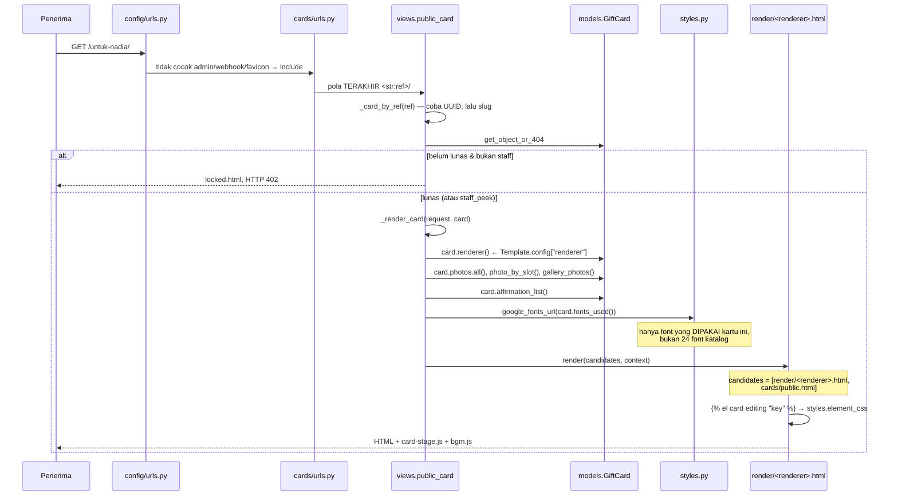

# Technical Documentation — Kartuku

> Dokumen untuk developer (manusia atau AI) yang akan menyentuh kode.
> Untuk gambaran produk, fitur, dan skema database, baca dulu
> [`01-PROJECT-BIBLE.md`](01-PROJECT-BIBLE.md).
> Semua klaim di sini diverifikasi dari kode pada 6 Agustus 2026 (commit `4556f6c`).

---

## 1. Justifikasi Teknologi

Tabel ini memisahkan dua hal dengan tegas: alasan yang **tertulis di kode/komentar**
(dikutip apa adanya) dan alasan yang **tidak tertulis di mana pun** (ditandai ⚠️).

### 1.1 Backend

| Teknologi | Versi | Kenapa dipilih | Trade-off yang diambil |
|---|---|---|---|
| **Django** | 5.2.* | Admin bawaan langsung jadi alat kerja pemilik situs (cari kartu pelanggan, lihat order Lynk) tanpa membangun dashboard sendiri. ORM + migrasi + templating + CSRF dalam satu paket. | Lebih berat dari micro-framework, tapi separuh fitur operasional datang gratis. |
| **PostgreSQL / SQLite** | psycopg 3.2 | `DATABASE_URL` kosong → SQLite. Komentar `DEPLOY.md`: *"SQLite aman di sini karena penyimpanan PythonAnywhere permanen. Pindah ke Postgres kalau penjualan sudah rutin."* | Dev dan produksi bisa beda engine. Kode secara eksplisit menangani perbedaannya — lihat §1.4. |
| **django-environ** | 0.12.* | Satu `.env`, tipe otomatis (`env.db_url`, `env.int`, `env.list`). | — |
| **WhiteNoise** | 6.12.* | Komentar `settings.py:52`: *"Menyajikan file di STATIC_ROOT langsung dari Django, jadi hosting tidak perlu dikonfigurasi menunjuk folder static."* Penting di PythonAnywhere gratis. | Sedikit overhead per request; tidak masalah di skala ini. |
| **Pillow** | 11.* | Validasi MIME **sesungguhnya** (bukan ekstensi), resize, kompresi, dan menggambar QR bergaya hati. | — |
| **qrcode[pil]** | — | Membuat QR menuju link kartu, lalu digambar ulang per modul jadi kotak membulat atau hati. | — |
| **gunicorn** | 23.* | WSGI produksi. | Tidak dipakai di PythonAnywhere (mereka punya WSGI sendiri) — tersisa untuk jalur VPS. |

### 1.2 Penyimpanan berkas

| Teknologi | Kenapa dipilih | Status |
|---|---|---|
| **FileSystemStorage** | Default. Foto ke `media/`. | Aktif |
| **Cloudflare R2** via django-storages + boto3 | `CLAUDE.md` §3 menyebut alasannya: **S3-compatible dengan egress gratis**. Untuk produk yang isinya foto dan linknya diteruskan berkali-kali, biaya keluar justru yang paling mahal di S3. | **Tidak aktif** — `USE_R2=False` |

Konfigurasinya sudah lengkap di `settings.py:134-149` (termasuk `signature_version: s3v4`
dan `querystring_auth: False` yang wajib untuk R2). Menyalakannya cukup dengan mengisi
5 env var dan `USE_R2=True`.

### 1.3 Gateway pembayaran

| Gateway | Kenapa ada | Status |
|---|---|---|
| **Midtrans** Core API QRIS | Rencana awal (`CLAUDE.md` §6): QRIS bisa dibayar dari e-wallet/m-banking apa pun, tanpa pembeli perlu punya akun di layanan tertentu. | Kode lengkap, **gateway tidur** |
| **Lynk.id** | `DEPLOY.md`: pembeli membayar di Lynk, situs tidak perlu mengirim email sama sekali, dan tidak perlu merchant account sendiri. Cocok untuk jualan lewat link di bio TikTok. | **Aktif** |

> ⚠️ **Perlu konfirmasi dari developer:** Midtrans akan diaktifkan pada tahap apa?
> Selama tidur, apakah jalur QRIS wajib ikut dirawat saat model kartu berubah,
> atau boleh dibiarkan beku sampai diaktifkan?

### 1.4 Keputusan yang tampak aneh sampai kamu tahu alasannya

Semuanya ditulis di komentar kode. Jangan "rapikan" tanpa membaca alasannya.

**`select_for_update()` sengaja TIDAK dipakai** (`models.py:AccessCode.claim`,
`payments/models.py:LynkOrder.claim`):

> *"SQLite tidak mendukung penguncian baris dan Django mengabaikannya diam-diam,
> jadi dua permintaan bersamaan bisa sama-sama lolos. Satu `UPDATE … WHERE
> used_at IS NULL` aman di semua database."*

**`transaction.atomic()` bersarang di DALAM `try`** (`payments/services.py:103-116`,
`payments/webhooks.py:94`):

> *"Menangkap IntegrityError tanpa ini meninggalkan transaksi dalam keadaan rusak
> di PostgreSQL — semua query sesudahnya gagal. SQLite memaafkannya, jadi bug ini
> tidak akan terlihat di dev; produksi memakai PostgreSQL."*

**`SECURE_REFERRER_POLICY = "strict-origin-when-cross-origin"`** (`settings.py:48`):

> *"Bawaan Django `same-origin` menahan SELURUH info asal ke domain lain, dan
> pemutar YouTube memakainya untuk memverifikasi situs pemanggil — tanpa itu musik
> latar selalu gagal dengan Error 153."*

**`SESSION_COOKIE_AGE` setahun + `SESSION_SAVE_EVERY_REQUEST`** (`settings.py:103`):

> *"Bawaan Django 2 minggu dihitung sejak cookie DIBUAT, bukan sejak kunjungan
> terakhir, jadi pembeli yang kembali di minggu ketiga kehilangan kartunya."*

**`SECURE_HSTS_PRELOAD` sengaja dibiarkan mati** (`settings.py:203`):

> *"Preload itu pintu satu arah: sekali masuk daftar browser, sulit dicabut, dan
> tidak pantas dinyalakan untuk subdomain milik bersama seperti `*.pythonanywhere.com`."*

**`SECRET_KEY` bawaan menggagalkan startup di produksi** (`settings.py:24`) —
`raise ImproperlyConfigured` kalau `DEBUG=False` dan kuncinya masih `dev-only-insecure-key`.
Gagal saat start jauh lebih baik daripada situs menyala tapi sesinya bisa dipalsukan.

### 1.5 Frontend

| Teknologi | Kenapa dipilih | Trade-off |
|---|---|---|
| **Django templates** | Server-rendered. Kartu publik harus cepat dibuka di HP penerima dengan koneksi apa adanya, dan harus punya tag Open Graph yang terbaca pengambil pratinjau WhatsApp (yang tidak menjalankan JS). | Interaktivitas harus ditulis manual. |
| **Alpine.js** (vendored, `static/js/alpine.min.js`) | Editor butuh state reaktif (elemen terpilih, gaya, antrean crop) tapi tidak butuh routing atau virtual DOM. | Tidak ada build step, tidak ada `package.json`, tidak ada `node_modules`. Konsekuensinya: tidak ada type checking dan tidak ada tree-shaking. |
| **Tanpa framework CSS** | `static/css/app.css` (1044 baris) ditulis tangan. | Tidak ada utility class; perubahan tampilan berarti menulis CSS. |
| **`` untuk cache-busting** | Komentar `card_extras.py:88`: *"Tanpa ini, browser memakai JS/CSS lama dari cache setelah file berubah — gejalanya editor 'kosong' atau berperilaku versi lama."* Memakai `?v=<mtime>`, bukan manifest hash. | Butuh berkas ada di disk saat request; `CompressedStaticFilesStorage` dipakai justru **tanpa** manifest hash supaya keduanya tidak bertabrakan. |

> ⚠️ **Perlu konfirmasi dari developer:** `CLAUDE.md` §3 menulis *"HTMX/Alpine.js
> untuk polling status"*, tapi kode nyata hanya memakai Alpine (di editor) dan
> `fetch` polos (di `pay.js`). HTMX tidak ada di repo. Apakah HTMX pernah dicoba
> lalu dibuang, atau memang tidak pernah dipakai?

### 1.6 DRF — dipakai, tapi tipis

`djangorestframework` terpasang dan 7 endpoint memakai `@api_view`, tapi:

- Tidak ada **serializer** satu pun di repo.
- Tidak ada **ViewSet** atau **router**.
- `DEFAULT_AUTHENTICATION_CLASSES: []` dan `AllowAny` — autentikasi DRF dimatikan total.

Yang benar-benar dipakai dari DRF: parsing JSON/multipart otomatis, objek `Response`,
dan **throttling** (`AnonRateThrottle` dengan tiga scope: `pay` 20/jam, `status`
240/menit, `upload` 120/jam).

> ⚠️ **Perlu konfirmasi dari developer:** DRF dipakai praktis hanya demi throttling
> dan parsing. Apakah ada rencana API publik yang membuatnya sepadan, atau ini
> sisa dari blueprint awal yang bisa disederhanakan?

---

## 2. Peta Keterhubungan Antar File

### 2.1 Graf import tingkat modul

```mermaid
graph TD
    subgraph config
        CU[config/urls.py]
        CS[config/settings.py]
    end

    subgraph cards
        CV[views.py]
        CA[api.py]
        CAP[api_photos.py]
        CF[forms.py]
        CST[styles.py]
        CUT[utils.py]
        CM[models.py]
        CSG[signals.py]
        CTT[templatetags/card_extras.py]
    end

    subgraph payments
        PW[webhooks.py]
        PS[services.py]
        PMT[midtrans.py]
        PL[lynk.py]
        PM[models.py]
    end

    CU --> PW
    CU --> CV

    CV --> CF
    CV --> CST
    CV --> CM
    CV --> PM

    CA --> PS
    CA --> PMT
    CA --> CM
    CA --> CV

    CAP --> CF
    CAP --> CST
    CAP --> CUT
    CAP --> CM
    CAP --> CV

    CF --> CST
    CF --> CUT
    CF --> CM

    CM -.lazy import.-> CST
    CSG --> CM
    CTT --> CST

    PW --> PL
    PW --> PS
    PW --> PMT
    PW --> PM
    PS --> PMT
    PS --> PM
    PS --> CM
    PM -.string ref "cards.GiftCard".-> CM
```

**Dua hal yang perlu diperhatikan dari graf ini:**

1. **`cards` dan `payments` saling bergantung di tingkat app**, tapi **tidak ada
   import melingkar di tingkat modul**. `payments/services.py` mengimpor
   `cards.models`, sementara yang mengimpor `payments` dari sisi `cards` hanyalah
   `views.py` dan `api.py` — dan `cards/models.py` tidak mengimpor `payments` sama
   sekali. `payments/models.py` merujuk kartu lewat string `"cards.GiftCard"`,
   bukan import. Rantai itulah yang menjaga graf tetap asiklik. **Jangan** menambah
   `from payments… import …` ke `cards/models.py`.

2. **`cards/models.py` memakai lazy import ke `styles`** (di dalam badan method
   `style_clean`, `colors_css`), bukan di kepala berkas. Ini disengaja agar model
   bisa dimuat lebih dulu.

### 2.2 Alur 1 — request kartu publik (jalur paling sering dibuka)



**`_render_card()` adalah satu-satunya jalur render kartu.** Ia dipakai tiga view:
`public_card`, `editor_frame`, dan (dengan bentuk sedikit berbeda) `preview`.
Kalau kamu menambah konteks baru untuk kartu, tambahkan di `_render_card` — bukan
di salah satu pemanggilnya. Bug nyata yang pernah terjadi: foto galeri hilang di
kartu asli karena konteksnya hanya ditambahkan di jalur editor.

### 2.3 Alur 2 — siklus editor ↔ iframe (bagian tersulit di proyek ini)

```mermaid
sequenceDiagram
    participant U as User
    participant E as alpine-editor.js<br/>(halaman induk)
    participant S as Server
    participant F as card-frame.js<br/>(dalam iframe)

    Note over E: init() — src iframe dipasang SEKALI
    E->>S: GET /create/<slug>/frame/?card=…&scene=…
    S->>F: HTML kartu asli (editing=True)
    Note over S:  TIDAK memancarkan gaya inline<br/>saat editing — kalau iya, ia menang<br/>atas stylesheet suntikan
    F->>E: postMessage {type:"ready", scenes:[…]}
    E->>F: replay() — semua gaya, warna, teks yang masih di memori
    Note over E,F: Tanpa replay, unggah foto akan<br/>menghapus tampilan editan

    U->>F: Klik elemen di kartu
    F->>F: event.target.closest("[data-edit],[data-frame]")
    Note over F: elemen TERDALAM menang
    F->>E: {type:"select", key:"cover_title", scene:"cover"}
    E->>U: Panel kiri menampilkan kontrol elemen itu

    U->>E: Ketik teks / pilih font
    E->>F: {type:"text"} atau {type:"style", css:"--f:…;--fs:…"}
    F->>F: tulis ke <style id="user-style">, bukan inline
    E->>E: queueSave() — debounce 600 ms
    E->>S: POST /api/cards/<uuid>/content/
    S->>S: sanitize_style + saring kunci teks
    S->>S: save(update_fields=[…]) — TIDAK menyentuh kolom pembayaran

    U->>E: Pilih foto
    E->>E: crop modal (canvas)
    E->>S: saveNow() DULU
    Note over E,S: unggah memicu preview reload;<br/>server harus sudah pegang teks terbaru
    E->>S: POST /api/cards/<uuid>/photos/
    E->>E: reloadFrame() — simpan & pulihkan scrollY
    E->>S: GET frame/?card=…&scene=… (babak dipulihkan lewat query)
```

**Protokol postMessage** — dua arah, dibedakan lewat field `source`:

| Arah | `source` | `type` | Payload |
|---|---|---|---|
| iframe → editor | `card-frame` | `ready` | `{scenes: [id, …]}` |
| iframe → editor | `card-frame` | `select` | `{key, scene}` |
| editor → iframe | `card-editor` | `style` | `{key, css}` |
| editor → iframe | `card-editor` | `colors` | `{colors: {key: "#hex"}}` |
| editor → iframe | `card-editor` | `text` | `{key, value}` |
| editor → iframe | `card-editor` | `scene` | `{value}` |
| editor → iframe | `card-editor` | `select` | `{key}` (pasang ulang sorotan) |
| editor → iframe | `card-editor` | `reload` | — |

**Empat jebakan yang sudah pernah menggigit dan sekarang dijaga kode:**

1. **`:src` reaktif pada iframe** membuat preview memuat ulang (dan balik ke sampul)
   begitu draft pertama dibuat. Sekarang `frameUrl()` dipanggil manual lewat
   `reloadFrame()`, tidak diikat reaktif.
2. **Posisi gulir hilang** saat iframe dimuat ulang. `reloadFrame()` menyimpan
   `scrollY` lalu memulihkannya **dua kali** — sekali di `load`, sekali lagi 180 ms
   kemudian setelah gambar menambah tinggi halaman.
3. **Babak balik ke sampul.** Dipulihkan lewat `?scene=` di URL iframe, dibaca
   `card-frame.js` sebelum halaman digambar.
4. **`specByKey` di luar objek Alpine tidak reaktif.** Foto per bingkai dipindah
   ke `framePhotos: {}` **di dalam** `x-data`. Sebelum itu, kolom caption tidak
   pernah muncul sampai user kebetulan memilih elemen lain lalu kembali — dan
   hampir tidak ada pembeli yang tahu kartunya bisa diberi caption.

### 2.4 Alur 3 — webhook masuk

```
POST /api/webhooks/lynk/
  → config/urls.py                      (di ATAS include cards.urls)
  → payments/webhooks.py:lynk_notification   @csrf_exempt @require_POST
      ├─ json.loads(request.body)            → 400 kalau bukan JSON
      ├─ lynk.verify_signature(payload, header)  → 403 kalau tidak cocok
      │    └─ LYNK_MERCHANT_KEY kosong → return False (MENOLAK)
      ├─ lynk.is_successful_payment()        → 200 "OK" kalau bukan payment.received
      ├─ lynk.read_order()                   → dict
      ├─ cek item_total >= LYNK_MIN_AMOUNT   → 200 "OK" kalau kurang
      └─ LynkOrder.objects.create()          → IntegrityError = duplikat, 200 "OK"
```

Prinsipnya: **selalu 200 untuk event yang sudah ditangani** (termasuk yang sengaja
diabaikan) supaya gateway berhenti retry. `403` **hanya** untuk tanda tangan
yang tidak cocok. Kalau kamu menambah webhook baru, ikuti bentuk ini persis.

---

## 3. Panduan Menambah Fitur Baru

### 3.1 Kasus paling sering — menambah teks yang bisa diedit user

**Nol baris Python.** Cukup dua tempat:

1. Tambah entri di `Template.config["texts"]` (lewat `/admin/cards/template/`
   atau `SEEDS` di `cards/management/commands/seed_templates.py`):
   ```python
   {"key": "penutup_kecil", "label": "Kalimat penutup", "default": "sampai jumpa"},
   ```
2. Pakai di template render:
   ```html
   <p class="penutup"></p>
   ```

Panel editor, penyimpanan, sanitasi, dan gaya per-elemen ikut jalan sendiri.
`key` **wajib** cocok `^[a-z][a-z0-9_]{0,31}$` (`styles.ELEMENT_KEY`) — kunci di
luar pola itu dibuang diam-diam oleh `sanitize_style`.

### 3.2 Menambah template render baru (contoh lengkap)

Misalkan kita ingin menambah template **"Pastel Manis"** untuk kategori Birthday.

**Langkah 1 — buat berkas render.**
`cards/templates/cards/render/pastel.html`. Halaman **berdiri sendiri** (bukan
``), dan wajib:

```html
<!doctype html>
<html lang="id" data-stage="flow">   <!-- "flow" (gulir) atau "frame" (berbabak) -->
<head>
  <meta charset="utf-8">
  <meta name="viewport" content="width=device-width, initial-scale=1">
  <meta name="robots" content="noindex">
     <!-- pratinjau WA/DM -->
    <!-- kanvas kanonis 390px -->
  <link href="{{ fonts_url }}" rel="stylesheet">
  <link rel="stylesheet" href="">
</head>
<body style="{{ card.colors_css }}">
  <div id="card-viewport"><div id="card-stage">
    <h1></h1>
    <p>{{ card.recipient_name }}</p>

    
      <figure>
        
          
        
      </figure>
    
  </div></div>

  
  
    <!-- WAJIB, tepat sebelum </body> -->
</body>
</html>
```

Tanpa `_preview_bar.html`, halaman preview tidak menandai dirinya sebagai contoh
dan pembeli mengira isi contoh itu kartunya.

**Langkah 2 — CSS yang bisa diatur user.** Jangan tulis warna/font langsung.
Baca dari CSS custom property dengan **nilai bawaan sebagai fallback**:

```css
/* static/css/render/pastel.css */
h1 {
  font-family: var(--f, 'Playfair Display', serif);
  font-size:   calc(2.5rem * var(--fs, 1));
  color:       var(--c, #6E3B48);
  text-align:  var(--al, center);
  font-weight: var(--fw, 400);
  font-style:  var(--fi, normal);
  letter-spacing: var(--ls, 0);
  line-height: var(--lh, 1.2);
}
figure img { object-fit: var(--fit, cover); border-radius: var(--br, 0); }
```

Var yang diemit `styles.element_css()`: `--f --fs --c --al --fw --fi --ls --lh
--fit --br --zoom --ox --oy`. Var permukaan global: `--c-<kunci>`.

> **Kunci pemahaman:** var **hanya diemit kalau user benar-benar mengubahnya**.
> Kalau tidak, `var(--f, <bawaanmu>)` jatuh ke bawaan — desain aslimu tetap utuh.

**Langkah 3 — daftarkan templatenya.** Tambahkan ke `SEEDS`:

```python
(
    "pastel-manis", "Pastel Manis", CardType.BIRTHDAY,
    {
        "accent": "#e8a0b0",
        "renderer": "pastel",                       # → render/pastel.html
        "frames": [
            {"key": "k1", "label": "Foto kenangan 1", "area": "kenangan"},
            {"key": "k2", "label": "Foto kenangan 2", "area": "kenangan"},
        ],
        "texts": [
            {"key": "cover_title", "label": "Judul", "default": "Selamat Ulang Tahun"},
        ],
    },
),
```

Lalu `python manage.py seed_templates` (idempoten — aman berulang).

**Langkah 4 — thumbnail galeri (opsional).** `static/img/thumb/pastel-manis.jpg`.
Tanpa itu, galeri memakai gradasi warna `accent` + nama template.

**Langkah 5 — cek.** Buka `http://localhost:8000/preview/pastel-manis/`.

**Langkah 6 — test.** `test_render_css.py` punya penjaga yang berlaku untuk
**semua** renderer (kanvas kanonis, tombol melayang di luar kanvas). Renderer
baru otomatis ikut terjaga; tambahkan entri ke daftar di berkas itu kalau ada
mode stage baru.

### 3.3 Menambah kolom baru di `GiftCard`

1. Tambah field di `cards/models.py`.
2. `python manage.py makemigrations cards` → **baca hasilnya** sebelum `migrate`.
3. Kalau kolomnya diisi dari editor, tambahkan di **tiga** tempat:
   - `cards/views.py:FIELD_ELEMENTS` — supaya muncul di panel editor.
   - `cards/views.py:editor` → `field_values` — supaya nilai awalnya terkirim.
   - `cards/api_photos.py:save_content` → blok `if isinstance(fields, dict)`
     **dan** daftar `changed`.
4. Kalau juga lewat jalur POST non-JS, tambahkan di `cards/forms.py:GiftCardForm.Meta.fields`.

> ⚠️ **Jebakan mematikan.** `save_content` memakai `save(update_fields=changed)`.
> Kalau kamu menambah kolom ke blok `fields` tapi **lupa** menambahkannya ke
> `changed`, nilainya tidak pernah tersimpan — tanpa error apa pun. Dan sebaliknya:
> **jangan pernah** mengganti itu jadi `card.save()` polos. Komentar di
> `api_photos.py:167` menjelaskan kenapa: kalau webhook menandai kartu `paid` di
> antara pembacaan dan penyimpanan, autosave menimpanya kembali jadi `pending` dan
> menghapus `paid_at`. Pembeli sudah bayar, kartunya tetap terkunci.

### 3.4 Menambah halaman informasi baru

1. View di `cards/views.py` (ikuti pola `page_faq`).
2. Template di `cards/templates/cards/pages/`, ``,
   sertakan ``.
3. Rute di `cards/urls.py` — **di atas** pola `<str:ref>/`.
4. Link di `templates/base.html` nav.
5. Tambahkan nama rutenya ke `HALAMAN` di `cards/tests/test_page_hygiene.py`.

Slug kartu yang menabrak halaman baru otomatis terlindungi: `reserved_slugs()`
membangun daftarnya dari `urlpatterns` nyata, jadi tidak ada yang perlu diingat.

### 3.5 Menambah gateway pembayaran baru

1. Modul client di `payments/<nama>.py` dengan **dua** fungsi minimal:
   `verify_signature(payload, header)` dan pembaca payload. Modul ini tidak boleh
   tahu apa pun soal Django views.
2. `verify_signature` **wajib** mengembalikan `False` kalau kuncinya kosong.
   Ikuti persis pola `lynk.py:66` dan `midtrans.py:122`.
3. Handler di `payments/webhooks.py`, `@csrf_exempt @require_POST`, dengan
   aturan 200/403 di §2.4.
4. Rute di `config/urls.py` (**bukan** `cards/urls.py`).
5. Model jejak di `payments/models.py` dengan constraint unik untuk idempotency.
6. Daftarkan di `payments/admin.py` sebagai **read-only** (`has_add_permission`
   dan `has_change_permission` → `False`).
7. Test dengan payload yang **disalin dari dokumentasi resmi gateway** —
   `payments/tests/test_lynk.py` melakukan ini dan itu yang membuatnya berharga.

---

## 4. Panduan Memperbaiki Bug

### 4.1 Alat yang tersedia

| Alat | Cara pakai |
|---|---|
| **Log server** | `tail -f ~/giftcard/server.log`. Semua `logger.info/warning/error` masuk ke sini (root logger → console, level INFO). |
| **Django admin** | `/admin/` — cari kartu (slug → nama → UUID), lihat Order Lynk & Event Pembayaran. |
| **Dashboard pemilik** | `/kartu-saya/` — semua kartu + link editor/bayar/publik dalam satu tabel. |
| **Debug musik** | Tambahkan `?bgmdebug=1` ke URL kartu — pemutar YouTube jadi terlihat beserta status errornya. |
| **`purge_drafts --dry-run`** | Lihat berapa kartu yang akan terhapus tanpa menghapusnya. |
| **`hapus_template <slug>`** | Tanpa `--konfirmasi` hanya melapor, termasuk peringatan kalau ada kartu lunas. |
| **`tools/pa.py`** | Jalankan perintah di PythonAnywhere dari laptop: `python3 tools/pa.py "cd ~/giftcard && git pull"`, `--reload`, `--deploy`. |

### 4.2 Urutan pengecekan yang disarankan

**Langkah 0 — pertanyaan yang menghemat waktu paling banyak:**

> **Apakah kamu membuka situs lewat `http://localhost:8000` atau `127.0.0.1:8000`?**

Kalau `127.0.0.1`, dan gejalanya menyangkut lagu/musik/YouTube — **berhenti di
sini**. YouTube menolak memutar video kalau halaman diakses lewat alamat IP mentah
(`127.0.0.1`, `192.168.x.x`). Nama host seperti `localhost`, `*.local`, dan domain
publik diterima. Menurut `CLAUDE.md` §13 ini pernah memakan waktu **sehari penuh**.

**Langkah 1 — apakah `.env` benar-benar terbaca?**

Setelah mengubah `.env`, **wajib restart penuh**:

```bash
launchctl kickstart -k gui/$UID/com.kartuku.server
```

Autoreload Django hanya memantau berkas `.py` dan **mewarisi environment lama**.
Gejalanya: perubahan env var seperti tidak berefek sama sekali.

**Langkah 2 — cek log.** `tail -50 ~/giftcard/server.log`. Yang dicari:

| Pesan di log | Artinya |
|---|---|
| `LYNK_MERCHANT_KEY kosong — webhook ditolak` | Konfigurasi belum lengkap, bukan bug |
| `MIDTRANS_SERVER_KEY kosong — webhook ditolak` | Idem |
| `Tanda tangan webhook Lynk tidak cocok` | Kunci salah, atau payload dimodifikasi di tengah jalan |
| `Webhook duplikat diabaikan: <txn>/<status>` | Normal — idempotency bekerja |
| `Webhook untuk order_id tak dikenal` | Kartunya sudah terhapus, atau order_id dari lingkungan lain (sandbox vs produksi) |
| `Order Lynk <ref> nominalnya kurang` | `LYNK_MIN_AMOUNT` lebih tinggi dari harga produk yang dibeli |
| `oEmbed gagal untuk …` / `Panggilan API gagal` | Normal di PythonAnywhere gratis (whitelist koneksi keluar). Gagal-aman: kartu tetap jalan, judul/cover lagu saja yang kosong |
| `Gagal menghapus berkas <nama>` | Berkas sudah tidak ada di storage; tidak menggagalkan penghapusan kartu |

**Langkah 3 — persempit berdasarkan gejala:**

| Gejala | Kemungkinan besar | Periksa |
|---|---|---|
| Kartu tidak bisa dibuka, 404 | Slug menabrak nama halaman situs | `views.reserved_slugs()`; cek urutan pola di `cards/urls.py` — `<str:ref>/` **harus terakhir** |
| Editan hilang setelah unggah foto | `saveNow()` tidak dipanggil sebelum unggah | `alpine-editor.js:sendPhoto` |
| Pilihan font "tidak berefek" di editor | Server memancarkan gaya inline saat `editing=True` | `card_extras.py:el` — saat `editing`, hanya `data-edit` yang boleh keluar |
| Preview balik ke sampul terus | `?scene=` hilang, atau `:src` diikat reaktif | `alpine-editor.js:reloadFrame/frameUrl` |
| JS/CSS lama yang jalan | Cache browser | Pastikan tag ``, bukan `` |
| Musik gagal, "Error 153" | `SECURE_REFERRER_POLICY` | `settings.py:48` harus `strict-origin-when-cross-origin` |
| Musik gagal, error 101/150 | Video diblokir pemiliknya | Normal. Cari versi dari channel berakhiran `- Topic` |
| Kartu berkedip ukuran saat dibuka | `card-stage.js` dimuat dengan `defer` | Harus sinkron di `<head>` (lihat `_stage_head.html`) |
| Foto gagal dimuat di produksi | Pemetaan `/media/` belum dibuat | `DEPLOY.md` §7 |
| Kartu lunas balik jadi `pending` | `card.save()` polos menimpa kolom pembayaran | Cari `\.save()` tanpa `update_fields` di jalur editor |
| Komentar developer tercetak di halaman | `{# … #}` ditulis lebih dari satu baris | Pakai `…`. Dijaga `test_page_hygiene.py` |
| Halaman bayar kosong, tidak ada QR | `MIDTRANS_SERVER_KEY` kosong (perilaku normal) | `context_processors.payment` menyembunyikan blok QRIS |

**Langkah 4 — reproduksi di test, baru perbaiki.** Lihat §4.4.

### 4.3 Menjalankan test

```bash
cd ~/giftcard
.venv/bin/python manage.py test              # seluruh suite
.venv/bin/python manage.py test cards        # satu app
.venv/bin/python manage.py test cards.tests.test_upload            # satu berkas
.venv/bin/python manage.py test cards.tests.test_upload.UnggahTests.test_x   # satu test
.venv/bin/python manage.py test --keepdb     # lebih cepat saat mengulang
.venv/bin/python manage.py test -v 2         # lihat nama tiap test
```

Django membuat database test terpisah; `db.sqlite3` dan `media/` tidak tersentuh.

**Peta suite — 267 test di 12 berkas:**

| Berkas | Jml | Fokus |
|---|---|---|
| `cards/tests/test_cards.py` | 82 | Model, view, ekstraksi YouTube ID, gating halaman publik |
| `cards/tests/test_upload.py` | 42 | Unggah foto **dengan berkas sungguhan** lewat API editor |
| `cards/tests/test_styles.py` | 39 | Sanitasi gaya, katalog font, emisi CSS |
| `payments/tests/test_lynk.py` | 18 | Webhook Lynk + penukaran REF ID, payload dari dokumentasi resmi |
| `cards/tests/test_editor_ux.py` | 16 | Empat bug editor yang ditemukan user saat uji coba |
| `payments/tests/test_webhook.py` | 14 | Signature Midtrans, idempotency, pemetaan status |
| `cards/tests/test_render_css.py` | 14 | Invarian tampilan kartu (kanvas kanonis, tombol melayang) |
| `cards/tests/test_social.py` | 10 | Tag Open Graph untuk pratinjau WA/DM |
| `cards/tests/test_page_hygiene.py` | 9 | Kebocoran komentar/TODO/link admin ke halaman pembeli |
| `cards/tests/test_payment_flow.py` | 6 | Create-charge QRIS, QR dipakai ulang |
| `cards/tests/test_recovery.py` | 6 | Pembeli yang kehilangan sesi tetap bisa mengambil kartunya |
| `cards/tests/test_payment_copy.py` | 6 | Teks pembayaran mengikuti metode yang aktif |
| `cards/tests/test_admin.py` | 5 | Pencarian admin menemukan apa yang pelanggan sebutkan |

> ⚠️ **Belum diverifikasi:** angka di atas dihitung dari jumlah `def test_` di tiap
> berkas. Suite ini **belum dijalankan** di sesi penulisan dokumen ini (permintaan
> read-only), jadi status lolos/gagalnya tidak diketahui. Jalankan
> `python manage.py test` sebelum bersandar padanya.

### 4.4 Menambah test untuk bug yang baru diperbaiki

Konvensi proyek ini kuat dan konsisten: **docstring test menjelaskan bug nyatanya,
bukan mekanisme test-nya.** Contoh dari `test_recovery.py`:

```python
"""Pembeli yang kehilangan sesinya harus tetap bisa mengambil kartunya.

Sesi hanya menyimpan daftar UUID kartu di cookie. Cookie itu hilang kalau
pembeli ganti perangkat, memakai browser lain, membersihkan riwayat, atau
sekadar kembali setelah cookienya kedaluwarsa. Dulu halaman aktivasi menjawab
403 dalam semua keadaan itu — pembeli sudah membayar di Lynk, lalu terkunci dari
kartunya sendiri tanpa jalan keluar apa pun.
"""
```

Ikuti bentuk itu. Tulis: **apa yang rusak, kenapa lolos dari test yang ada, dan
apa akibatnya bagi pembeli.**

Dua pola yang layak ditiru:

**1. Penjaga struktural, bukan per-kasus.** `test_page_hygiene.py` membaca **semua**
berkas `.html` di proyek, bukan daftar halaman yang didaftarkan tangan. Alasannya
ditulis di docstring: *"Test per-halaman tidak cukup: ia hanya menjaga halaman yang
sempat didaftarkan, dan justru halaman yang terlupa itulah yang bocor."*

**2. Penjaga untuk penjaganya.** Berkas yang sama punya:

```python
def test_penjaga_ini_memang_memindai_sesuatu(self):
    """Kalau pencarian berkasnya rusak, test di atas lolos tanpa memeriksa
    apa pun — kegagalan paling berbahaya untuk sebuah penjaga."""
    jumlah = len(list(self.berkas_template()))
    self.assertGreater(jumlah, 10, f"hanya {jumlah} template ditemukan")
```

Kalau kamu menulis test yang memindai berkas atau mengumpulkan sesuatu secara
dinamis, tulis juga penjaga bahwa ia benar-benar menemukan sesuatu.

---

## 5. Environment & Setup

### 5.1 Instalasi lokal (macOS, mesin ini)

```bash
cd ~/giftcard
uv venv .venv --python 3.12      # kalau .venv belum ada
uv pip install -r requirements.txt
cp .env.example .env             # lalu isi
.venv/bin/python manage.py migrate
.venv/bin/python manage.py seed_templates
.venv/bin/python manage.py createsuperuser
.venv/bin/python manage.py runserver
```

> **Venv dibuat dengan `uv`, tanpa `pip` bawaan.** Pasang paket dengan
> `uv pip install <nama>`, bukan `pip install`. Jalankan perintah lewat
> `.venv/bin/python manage.py …`.
>
> Menurut catatan proyek, `brew python@3.12` di Mac ini rusak — `uv` adalah jalur
> yang bekerja.

Lalu buka **`http://localhost:8000/`** — **bukan** `127.0.0.1:8000`. Lihat §4.2 Langkah 0.

### 5.2 Server yang menyala sendiri (mesin dev ini)

Server dijalankan `launchd` lewat `~/Library/LaunchAgents/com.kartuku.server.plist`,
otomatis menyala saat login, bind ke `0.0.0.0:8000`, log ke `~/giftcard/server.log`.

```bash
launchctl kickstart -k gui/$UID/com.kartuku.server   # restart penuh (WAJIB setelah ubah .env)
launchctl bootout gui/$UID/com.kartuku.server        # matikan
launchctl bootstrap gui/$UID ~/Library/LaunchAgents/com.kartuku.server.plist   # nyalakan
```

### 5.3 Environment variable

| Var | Wajib? | Default | Efek kalau kosong |
|---|---|---|---|
| `DJANGO_SECRET_KEY` | **Ya di produksi** | `dev-only-insecure-key` | `ImproperlyConfigured` saat start kalau `DEBUG=False` |
| `DJANGO_DEBUG` | — | `False` | `True` membuka `/kartu-saya/` dan tombol "Aktifkan tanpa bayar" untuk umum |
| `ALLOWED_HOSTS` | Ya di produksi | `localhost,127.0.0.1` | Django menolak request dari host lain |
| `CSRF_TRUSTED_ORIGINS` | Ya di produksi | `[]` | POST dari domain HTTPS ditolak |
| `DATABASE_URL` | — | SQLite di `BASE_DIR` | Dev pakai SQLite |
| `YOUTUBE_API_KEY` | — | `""` | Validasi embeddable dilewati (gagal-aman, kartu tetap bisa dibuat) |
| `MIDTRANS_SERVER_KEY` | — | `""` | Blok QRIS disembunyikan di seluruh situs; webhook Midtrans **ditolak** |
| `MIDTRANS_CLIENT_KEY` | — | `""` | — |
| `MIDTRANS_IS_PRODUCTION` | — | `False` | Memakai `api.sandbox.midtrans.com` |
| `MIDTRANS_MERCHANT_ID` | — | `""` | — |
| `LYNK_MERCHANT_KEY` | **Ya untuk jalur Lynk** | `""` | Webhook Lynk **ditolak 403** — tidak ada kartu yang bisa diaktifkan lewat REF ID |
| `LYNK_MIN_AMOUNT` | — | `CARD_PRICE` (15000) | Nominal minimum yang dianggap sah untuk 1 kartu |
| `USE_R2` | — | `False` | Foto disimpan di `media/` lokal |
| `R2_ACCOUNT_ID` / `R2_ACCESS_KEY_ID` / `R2_SECRET_ACCESS_KEY` / `R2_BUCKET_NAME` / `R2_PUBLIC_URL` | Hanya kalau `USE_R2=True` | — | **Wajib semua** kalau `USE_R2=True` — `env()` tanpa default akan melempar saat start |

**Catatan tentang `.env` lokal saat ini:** hanya memuat 9 var (`DJANGO_SECRET_KEY`,
`DJANGO_DEBUG`, `ALLOWED_HOSTS`, `CSRF_TRUSTED_ORIGINS`, `YOUTUBE_API_KEY`, dan 4 var
Midtrans). `USE_R2`, `LYNK_MERCHANT_KEY`, dan `LYNK_MIN_AMOUNT` **tidak ada** dan
jatuh ke default. Konsekuensinya di laptop: **webhook Lynk selalu ditolak 403**.
Itu perilaku yang benar, bukan bug — uji jalur Lynk butuh kunci sungguhan.

### 5.4 Konstanta aplikasi (`config/settings.py`)

| Konstanta | Nilai | Dipakai di |
|---|---|---|
| `CARD_PRICE` | `15_000` | Harga default kartu, batas minimum Lynk |
| `QR_TTL_MINUTES` | `15` | `qr_expires_at`, `custom_expiry` Midtrans |
| `MAX_PHOTOS_PER_CARD` | `30` | Batas foto **galeri** (bingkai tidak dihitung) |
| `MAX_PHOTO_BYTES` | `3 MB` | `utils.validate_and_compress_photo` |
| Throttle `pay` / `status` / `upload` | 20/jam, 240/menit, 120/jam | `AnonRateThrottle` di `api.py` & `api_photos.py` |

Konstanta lain yang tidak di settings tapi sering dicari:

| Konstanta | Nilai | Lokasi |
|---|---|---|
| `MAX_DIMENSION` | 1600 px | `cards/utils.py` — semua foto dinormalisasi ke JPEG |
| `JPEG_QUALITY` | 82 | `cards/utils.py` |
| `MAX_AFFIRMATIONS` | 4 | `cards/models.py:GiftCard` |
| `MAX_TEXT_KEYS` / `MAX_TEXT_LENGTH` | 60 / 300 | `cards/forms.py` |
| `MAX_ELEMENTS` | 80 | `cards/styles.py` |
| `CODE_MAX_ATTEMPTS` / `CODE_ATTEMPT_WINDOW` | 12 / 1 jam | `cards/views.py` |
| `W0` (lebar kanonis kartu) | 390 px | `static/js/card-stage.js` + `--w0` di CSS |

### 5.5 Build & deploy

**Tidak ada build step frontend.** Tidak ada `package.json`, `node_modules`, bundler,
atau transpiler. CSS dan JS ditulis dan disajikan apa adanya (Alpine di-vendor
sebagai berkas minified di repo).

Deploy penuh ada di [`../DEPLOY.md`](../DEPLOY.md). Ringkasnya:

```bash
# di PythonAnywhere
cd ~/giftcard && git pull
python manage.py migrate
python manage.py collectstatic --noinput
# lalu Reload di tab Web
```

Atau dari laptop: `python3 tools/pa.py --deploy`.

Yang **tidak boleh terlewat** menurut `DEPLOY.md`:
- `DJANGO_DEBUG=False` dan `SECRET_KEY` **baru** (kunci dev sudah bocor ke riwayat percakapan).
- Pemetaan static `/media/` → `/home/kartuku/giftcard/media` di tab Web. Tanpa ini
  **semua foto di kartu gagal dimuat** — WhiteNoise hanya menangani CSS/JS.
- Scheduled task harian `purge_drafts` — tanpa ini disk 512 MB penuh oleh kartu
  yang ditinggalkan orang.
- `LYNK_MERCHANT_KEY` diisi **setelah** URL webhook disimpan di dashboard Lynk
  (kuncinya baru muncul sesudah itu), lalu Reload.

### 5.6 Menguji webhook dari laptop

Gateway harus bisa menjangkau localhost, jadi pakai tunnel:

```bash
cloudflared tunnel --url http://localhost:8000
```

Lalu tambahkan host tunnel ke `ALLOWED_HOSTS` dan `CSRF_TRUSTED_ORIGINS` di `.env`,
**restart penuh** (`launchctl kickstart -k …`), dan set URL webhook di dashboard
gateway ke `https://<host-tunnel>/api/webhooks/lynk/` (atau `/midtrans/`).

---

## 6. Temuan Teknis yang Layak Diperiksa

Ditemukan saat membaca kode untuk dokumen ini. Bukan bug yang menggigit sekarang,
tapi layak dibersihkan atau dikonfirmasi.

| Temuan | Lokasi | Catatan |
|---|---|---|
| `init.palettes` selalu `undefined` | `static/js/alpine-editor.js:40` vs `cards/views.py:editor` | `styles.PALETTES` (8 palet) tidak pernah dimasukkan ke `editor_init`. ⚠️ Dibatalkan atau belum tersambung? |
| `PhotoUploadForm`, `MultipleFileField`, `MultipleFileInput` tidak dipakai | `cards/forms.py:146-176` | Tidak diimpor di berkas mana pun, tidak disebut di test mana pun. Sisa dari era sebelum foto pindah ke `api_photos.py`. Docstring `MultipleFileField` masih berharga sebagai catatan sejarah. |
| `transaction` diimpor tapi tidak dipakai | `cards/views.py:8` | `from django.db import IntegrityError, transaction` — hanya `IntegrityError` yang dipakai. |
| Renderer `kanvas` tidak dirujuk template mana pun | `cards/templates/cards/render/kanvas.html` | Hanya dibuat di `test_render_css.py`. ⚠️ Contoh acuan atau template yang belum di-seed? |
| Tag `` selalu mengembalikan `""` | `cards/templatetags/card_extras.py:47` | Sengaja — fitur ganti latar dihapus atas permintaan user, tag dipertahankan agar template lama tidak rusak. Terdokumentasi, bukan temuan. |

---

## 7. Prinsip Update Dokumentasi

**Setiap kali menambah fitur besar atau mengubah arsitektur, WAJIB update
[`01-PROJECT-BIBLE.md`](01-PROJECT-BIBLE.md) dan dokumen ini di PR/commit yang sama.**

Yang harus ikut diperbarui:

| Perubahan | Update di |
|---|---|
| Kolom/model baru | Bible §5 (tabel skema + ERD + daftar migrasi) |
| Rute baru | Bible §6 (tabel rute + hitungan total) |
| Fitur baru | Bible §2 (tabel fitur + status) |
| Dependency baru | Technical §1 (justifikasi + trade-off) — **tulis alasannya**, jangan biarkan orang berikutnya menebak |
| Env var baru | Technical §5.3 |
| Alur baru | Bible §7 (diagram mermaid) |
| Gateway/integrasi baru | Bible §4.3, Technical §2.4 & §3.5 |
| Bug yang perlu diingat | Technical §4.2 (tabel gejala) + docstring test |

Setelah selesai, sinkronkan juga [`03-MASTER-PROMPT.md`](03-MASTER-PROMPT.md) —
prompt itu adalah ringkasan padat kedua dokumen di atas dan jadi salah kalau tertinggal.
